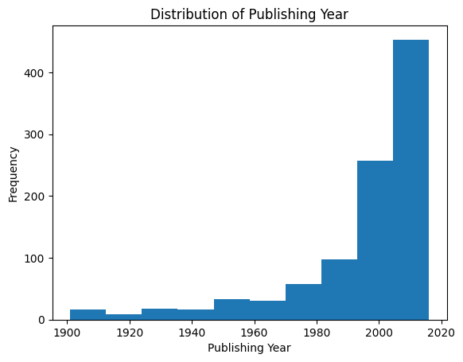
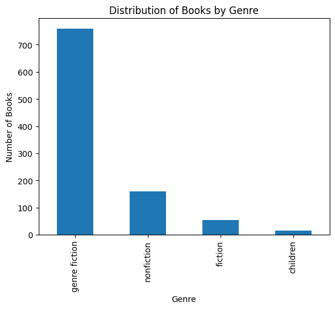
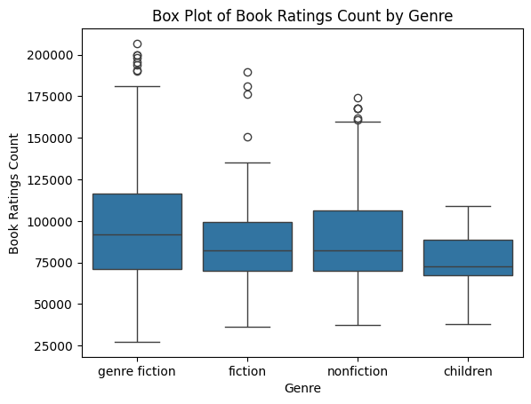
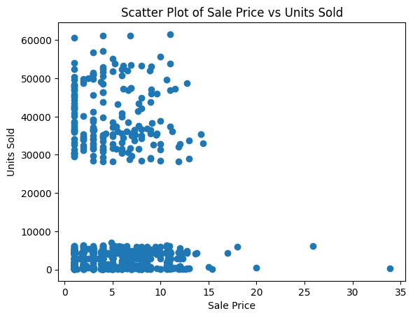
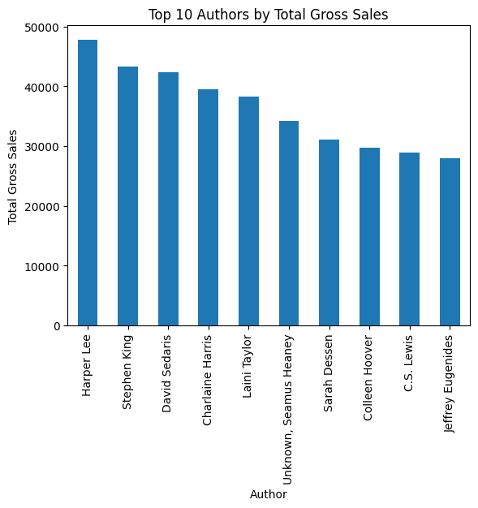
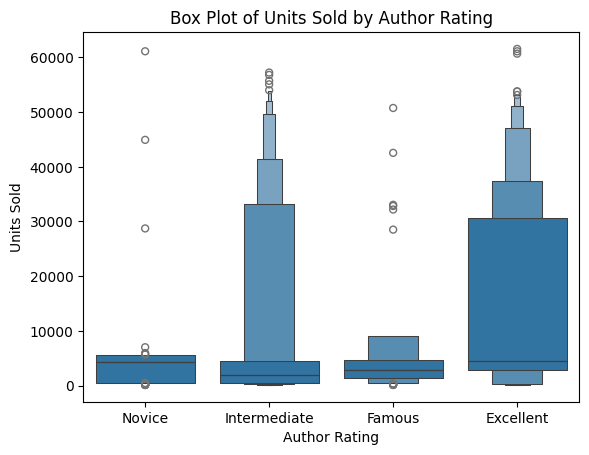

# Análise Exploratória de Dados de Livros (EDA)
Este projeto realiza uma análise exploratória de dados de livros para entender padrões e características do dataset. O código utiliza Python e bibliotecas de análise de dados para processamento e visualização.

## 🔍 Principais Descobertas
- **Distribuição Temporal**  
    
  *Pico de publicações após 2000*

- **Gêneros Mais Populares**  
    
  *"Genre Fiction" domina o catálogo*

- **Distribuição do número de avaliações de livros para cada gênero**
  
  
- **Correlação entre preço e quantidade vendida**
  
  *Preços mais altos vendem menos.*


## 📸 Visualizações-Chave


### Top 10 Autores por venda BRUTA



### Quantidade de livros vendidos varia com base na avaliação do autor



# 🛠️ Tecnologias Utilizadas
Python 3.12

Bibliotecas:

- Pandas (Manipulação de dados)
- Matplotlib/Seaborn (Visualização)
- Jupyter Notebook (Ambiente interativo)

# ⚙️ Instalação

1. Clone o repositório:
```ruby
git clone https://github.com/Mogutaa/Data_Analysis_Portfolio_Project_Book_Sales.git
```
2. Instale as dependências:
```ruby
pip install pandas matplotlib seaborn jupyter
```
3. Execute o Jupyter Notebook:
```ruby
jupyter notebook Notebook.ipynb
```

# 📊 Principais Etapas da Análise
1. Carregamento e Inspeção Inicial
- Visualização das primeiras 5 entradas
- Estatísticas descritivas

2. Limpeza de Dados

- Filtragem de anos de publicação (> 1900)
- Remoção de valores ausentes

3. Verificação de duplicatas

- Visualizações
- Distribuição de anos de publicação
- Frequência de gêneros literários
- Relação entre avaliações e vendas
- Insights
- Autores com melhores avaliações médias
- Padrões temporais nas publicações

# 🗂️ Estrutura do Projeto

.
├── Notebook.ipynb          # Análise completa
├── dataset/
│   └── Books_Data_Clean.csv  # Dataset original
│   images/
│   ├── box_plot_of_book_ratings_count_by_genre.png
│   └── ...
├── README.md               # Documentação
└── requirements.txt        # Dependências

# 🤝 Contribuição
Contribuições são bem-vindas! Siga estas etapas:

1. Faça um fork do projeto

2. Crie uma branch (git checkout -b feature/nova-feature)

3. Commit suas mudanças (git commit -m 'Adiciona nova feature')

4. Push para a branch (git push origin feature/nova-feature)

5. Abra um Pull Request

# 📄 Licença
Este projeto está sob licença MIT - veja LICENSE para detalhes.
